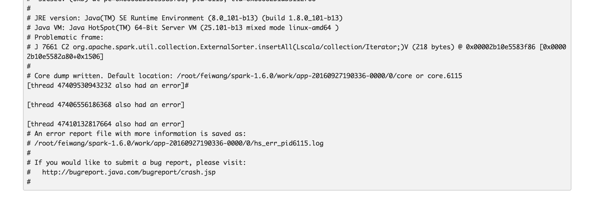
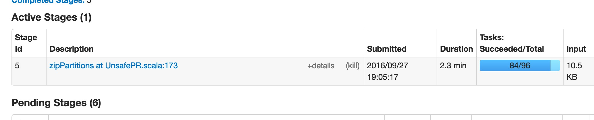

## 关于Spark将数据放在jvm堆外所产生的奇怪bug(2016-09-28)

### 思路实现与问题产生
   我们内存计算小组博士的文章Deca经过一年的努力终于中了vldb,作为其中参与了一些微小的
工作的男人,虽然对其中一部分细节不是太清楚,因为这个Deca系统的开发涉及到将近5个人,我
的工作囊括一下就是: 1.完成了其中UDF的转换,将方法的操作转为对字节数组的操作;2.手写
了Deca的手动版的代码,就是利用Deca的思想对Spark应用的代码进行改造;3.进行了大量的测试
并统计GC时间,stage时间等相关数据.其实Deca系统的核心思想就是将原有的java大对象转化为
字节数组有序地放置在jvm中,这样一可以减少对内存的使用,也可以基本避免所有的GC.
附上论文[Deca论文地址](https://arxiv.org/pdf/1602.01959v3.pdf)

  老板的top中了之后,当然会将它扩展扩展然后投期刊,这是基本套路.要求扩展30%,其中就包括
将之前的手动版的数据放置在堆外,还是以字节数组的形式来和堆内版本进行比较,理论上来说
堆外版本肯定性能是比堆内好的,毕竟放置在堆外可以完全逃避GC的控制,也更加符合Deca的思想.

  代码实现并不难,基本由Unsafe这个类操作完成.大概思路就是将Spark应用中需要缓存的RDD
其中的partition的对象用字节数组的形式写在堆外,读的时候再直接按照偏移量读取,贴上部
分代码:
```java
  import UnsafePR._
  private val baseAddress = UNSAFE.allocateMemory(size)
  private var curAddress = baseAddress
  def address = baseAddress
  def free:Unit={
    UNSAFE.freeMemory(baseAddress)
  }
  def writeInt(num:Int):Unit={
    UNSAFE.putInt(curAddress,num)
    curAddress += 4
  }
```
[完整的Deca手动版PageRank代码地址](https://github.com/zx247549135/DecaApplication/blob/master/src/main/scala-2.10/decaApp/UnsafePR.scala)

起先在本机的local模式测试了堆外版LR和PageRank应用当然是没问题的,结果也是正确的.然后
转移到服务器集群上进行测试.令人惊喜的是,一个神奇的bug出现了.


### Bug的特征
此Bug是本人coding以来见识到的算的上奇怪的一个bug了,它有以下几个特征.首先LR的堆外版本
集群测试是没有问题的,但是切换到PageRank的堆外版本来测试时,总是在ZipPartition这个stage最后几个
task执行的时候jvm crash掉,这个job就直接卡死了,必须手动杀掉才能停止.executor异常日志:


stage卡住图示:


而且还有一个特殊的症状:就是PR跑2G数据量的时候居然不会挂掉,一到7G和20G的时候就会挂掉.
而且local模式不会出错,一个executor也不会出错,一旦增加到多个executor就会出错.

### Bug原因分析与结论
一开始想到的原因是shuffle的问题,因为local和单个executor不会出错,一旦涉及到网络传输就会报错.
我怀疑是不是序列化方式的问题,分别用kryo和java自带的序列化方式测试了一下,然而都会报错.
后来想了想应该不是网络传输的问题,不然小数据量怎么可以通过.我上网查了一下jvm crash那段报错信息,
基本都是由于Unsafe访问到非法位置的原因,于是开始往这个方向考虑.

最后与师兄讨论中意识到问题的关键所在,首先Spark一个executor执行task比较慢时,如果另一个executor执行完一个stage的所有task时,会将剩余
的task调度到那个节点去执行,也就是non-local task.non-local task是从网络传输过去的,这部分task是由cache RDD
的partition生成而来的,这部分task是从block manager过去的,然而partition中的UnsafeEdge对象中只有一个Unsafe成员变量,
一个初始地址和终点地址,和分配在jvm堆内的对象不同,并不携带真正的数据.所以这个task被调度到其他executor时,自然
会非法访问堆外内存,然后jvm crash掉,这也可以解释为什么stage中位置为Any的task都不能成功执行这个现象.
至于2G的数据量为什么可以通过,因为task运行的时间很短,几乎不需要调度就可以在一个executor中全部完成.

所以解决方案就是尽量不让task调度到其他的executor上执行,可以尽量增大spark.locality.wait这个变量来
避免出错.


